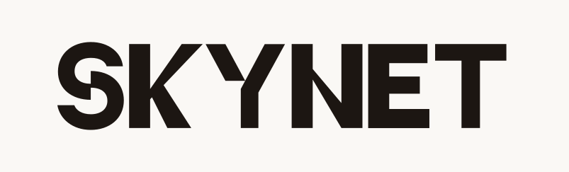

<p align="center">
  
</p>

**A private, Hebrew-first platform for building, optimizing, and serving LLM programs on your own infrastructure.**

This edition tracks the public Skynet product surface while replacing hosted SaaS concerns with an on-prem architecture: PostgreSQL-only state, administrator-managed identities, ADFS/OIDC, local observability, organization-managed models, and provider-agnostic BYOK. It contains no Stripe, credit ledger, billing, or licensing enforcement.

## Product surface

- Guided optimization runs, GEPA checkpoints, grid search, live progress, result inspection, serving, and export.
- Dataset library, spreadsheet editing, named-user sharing, cloning, and AI-assisted tagging.
- Generalist and code agents, workflow canvas, model discovery, and saved provider connections.
- Authenticated Explorer with a deployment-wide public corpus. Every run starts private and appears there only after its owner explicitly publishes it.
- Hebrew-only RTL UI.
- ADFS/OIDC primary login plus a passwordless local username fallback. Administrators create, promote, demote, quota, and delete local users in the UI.
- PostgreSQL-backed queues, leases, telemetry, audit context, quotas, and application state. Redis is not required.

## Local deployment

Prerequisites: Docker Compose, or Python 3.12 + Node 22 + PostgreSQL 16 for native development.

```bash
cp backend/.env.example backend/.env
cp frontend/.env.example frontend/.env.local

# Set the same BACKEND_AUTH_SECRET in both files, then:
cd backend
docker compose up --build
```

Open `http://localhost:3001`. With no SSO variables configured, only usernames created by an administrator can enter. Seed the first administrator with `ADMIN_USERNAMES` in `backend/.env`; use the same normalized username in `AUTH_ADMINS` if desired.

Native development remains available:

```bash
just install
just backend    # FastAPI on :8000
just frontend   # Next.js on :3001
```

The API reference is at `http://localhost:8000/reference`.

## Architecture

```text
frontend/   Next.js 16, React 19, Hebrew RTL UI, NextAuth OIDC/local login
backend/    FastAPI, SQLAlchemy, DSPy, GEPA, embedded Postgres-lease worker
postgres/   users, jobs, datasets, sharing, BYOK metadata, telemetry, queue leases
deploy/     OpenShift/Kubernetes Helm chart and optional Postgres-only LiteLLM proxy
```

Horizontal backend replicas safely share work through PostgreSQL `SELECT ... FOR UPDATE SKIP LOCKED` claims and renewable leases. Crashed work is reclaimed after lease expiry. Resource admission delays new claims when a container approaches its memory limit.

## Identity and authorization

- Configure ADFS or another OIDC provider with `AUTH_SSO_*` variables.
- Valid SSO users are auto-provisioned. Username normalization makes an ADFS identity and a matching local username the same account, with one data set, role, and quota.
- Local login has no password. It succeeds only for an active username already created by an administrator.
- Environment usernames/groups remain external admin grants; UI role changes are stored in PostgreSQL.
- Deleting a user hard-deletes all owned data, grants, preferences, quota overrides, and BYOK secrets. A later valid SSO login creates a fresh account.

## Data and sharing

- Private is the default for optimization runs.
- Owners may explicitly publish a run to the authenticated deployment-wide Explorer corpus.
- Named-user sharing is supported for optimizations, datasets, and tagging sessions.
- Anonymous and anyone-with-link access are disabled.
- The only administrator-set consumption limit is a per-user unified storage allowance; the default is 250 MiB.

## Models and BYOK

Operators may configure central OpenAI-compatible model endpoints. Users can also save arbitrary provider/model schemas and encrypted secrets. BYOK is passed through to the selected provider without a provider allowlist, credit charge, or markup. Set `BYOK_VAULT_KEY` before allowing users to save keys.

## Deployment

- Docker Compose: `backend/docker-compose.yml`
- OpenShift/Kubernetes: `deploy/helm/skynet`
- Air-gapped build notes: `backend/AIRGAP.html`

The Helm chart enables TLS redirects, NetworkPolicies, HPAs, PodDisruptionBudgets, Prometheus scraping, a migration Job, and optional PgBouncer. It supports either bundled PostgreSQL or an external PostgreSQL service.

## Verification

```bash
cd backend && uv run pytest core tests/unit -q
cd frontend && npm run typecheck && npm run lint && npm test
python scripts/generate_i18n.py --check
helm lint deploy/helm/skynet
```

## License

[AGPL-3.0](LICENSE).
